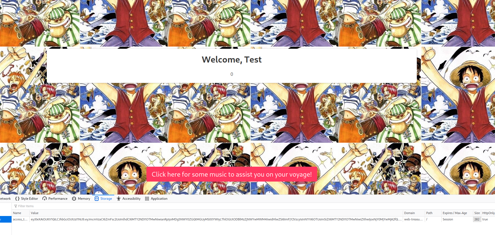
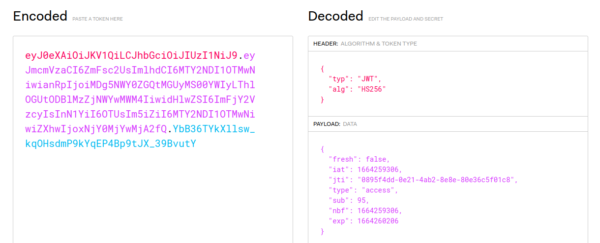
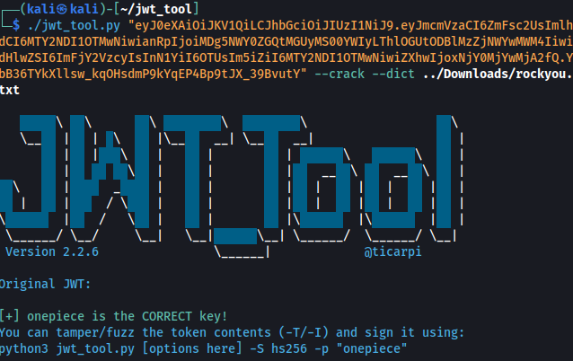
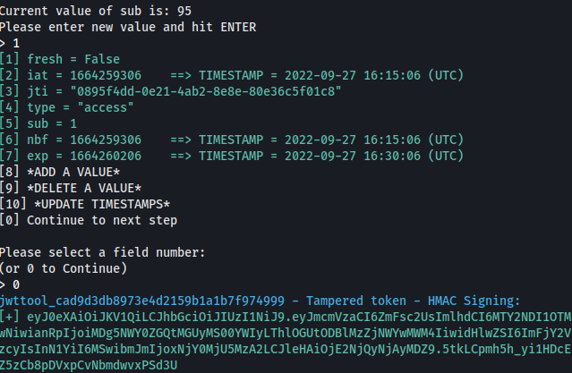
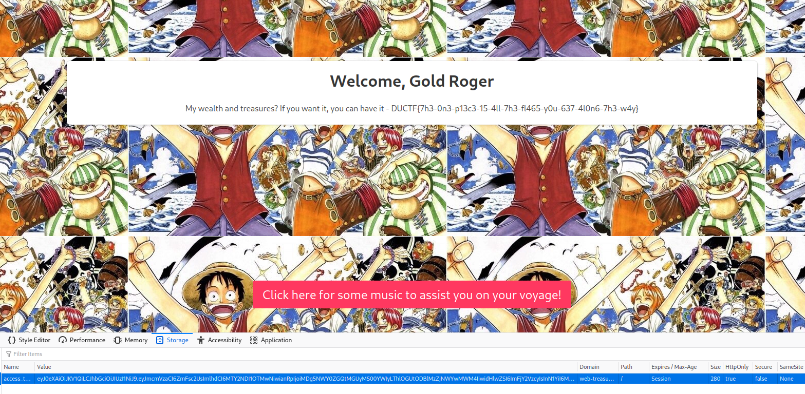

# DUCTF 2022 - Treasure Hunt Writeup

For this challenge, we are given a One Piece themed website with a simple sign up and login page. As part of my methodology, I intially tried a simple SQL injection to see if the login could be bypassed. When this failed, I created a test user account and logged in, to see if I could find any other information that I could exploit in order to find the flag.



After using "Inspect" in Firefox, I noticed a new cookie starting with the characters "eyJ" - a dead giveaway that this is a JSON Web Token (or a Flask session cookie). To verify this, I copied the entire cookie's string to [JWT.io](https://jwt.io).



Under the "Payload" section, we can see all the values inside the JWT. Of great interest to me was "sub" (or Subject) value of 95. If we can change this to 1, we should be able to access the first (or admin) account created which hopefully will have the flag. However, since the JWT is encrypted with a secret password, this was not as simple as changing the value on the website.

By using the [JSON Web Token Toolkit](https://github.com/ticarpi/jwt_tool), we are easily able to manipulate the token in order to gain access to an account we don't own. First, I tried changing the encryption algorithm to "none" to see if the website will still accept the token (CVE-2015-2951). Unfortunately this didn't work, so my next idea was to crack the password with a dictionary attack on the "rockyou" password list.



**Success!** With the newly found password of "onepiece", we can forge a JWT with any parameters we want - specifically, one with the "sub" value set to 1.



After copying the forged JWT back into Firefox and reloading the webpage, we have access to the first account created as well as the flag.



```Flag: DUCTF{7h3-0n3-p13c3-15-4ll-7h3-fl465-y0u-637-4l0n6-7h3-w4y}```
